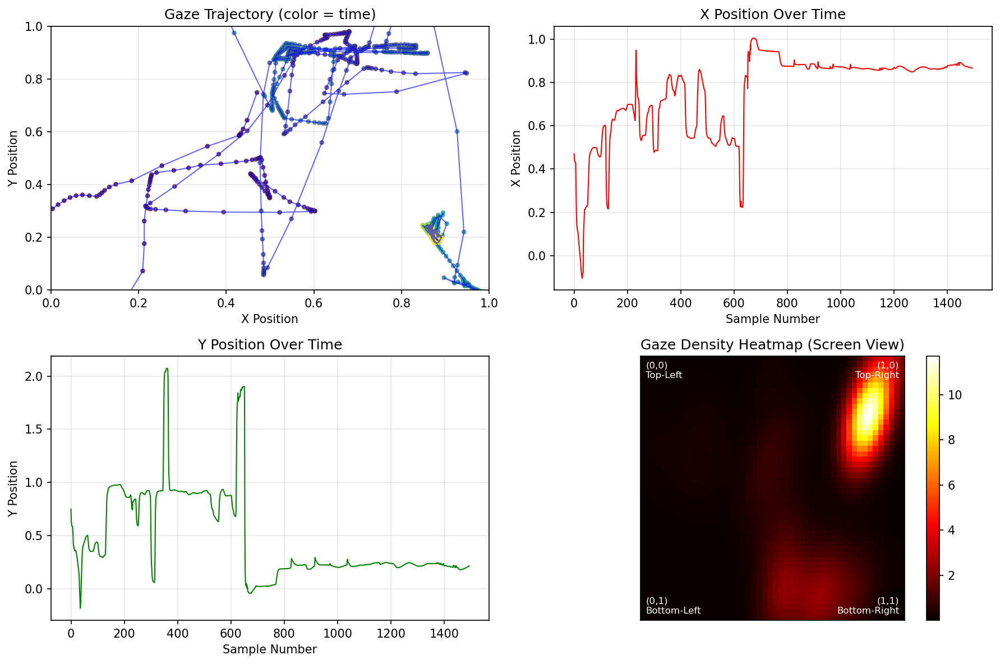

# Enhanced Tobii Eye Tracker 5 for Research

A comprehensive solution for using the consumer Tobii Eye Tracker 5 as a research instrument, featuring continuous recording, automated data analysis, and experiment integration capabilities.


## Overview

This project transforms the consumer-grade Tobii Eye Tracker 5 into a capable research tool by bridging the gap between Tobii's Stream Engine API (consumer) and research requirements. The system provides high-quality gaze coordinate data at effective sampling rate with microsecond-precision timestamps.

**Built upon the foundational work of [Tammie-Li's Tobii-Eye-Track repository](https://github.com/Tammie-Li/Tobii-Eye-Track)**, this enhanced version adds:

- Continuous recording mode alongside original burst mode
- Automated timestamped data files
- Real-time data visualization and analysis
- Experiment integration framework
- Enhanced Python controller with interactive file management

## Key Features

### Recording Modes

- **Burst Mode**: Collect exactly 10 data callbacks (original functionality)
- **Continuous Mode**: Record indefinitely until manually stopped
- **Automated File Management**: Timestamped filenames prevent data overwrites

### Data Quality

- **Coordinate System**: Normalized 0.0-1.0 screen coordinates
- **Timing Precision**: Microsecond-level timestamps for event synchronization
- **Automatic Filtering**: Only valid gaze samples saved to file

### Analysis Tools

- **Real-time Visualization**: Gaze trajectories, time series, and density heatmaps
- **Interactive File Selection**: Analyze any previous recording session
- **Statistical Summaries**: Sample counts, ranges, and quality metrics
- **Export Capabilities**: High-resolution plots with matching timestamps

## Prerequisites

### Hardware

- Tobii Eye Tracker 5
- Windows 10/11 (required for Tobii Stream Engine compatibility)

### Software

- **Development Environment**: MSYS2 MinGW64
- **Python Environment**: Anaconda or Miniconda
- **Build Tools**: make, g++, cmake (via MSYS2)

## Installation

### 1. Clone Repository

```bash
git clone https://github.com/basophobic/enhanced-tobii-eyetracker.git
cd enhanced-tobii-eyetracker
```

### 2. Setup Python Environment

```bash
# Create conda environment from file
conda env create -f environment.yml
conda activate eyetracking
```

**Alternative manual setup:**

```bash
conda create -n eyetracking python=3.9
conda activate eyetracking
conda install numpy pandas matplotlib scipy pygame
```

### 3. Build C++ Program

```bash
# In MSYS2 MinGW64 terminal
make clean
make
```

### 4. Verify Installation

```bash
# Check if executable was created
dir bin/eyeTrack.exe

# Test Python environment
python python/enhanced_controller.py --help
```

## Usage

### Quick Start

```bash
# Terminal MINGW64: Start the eye tracker program
cd /C/enhanced-tobii-eyetracker/bin
./eyeTrack.exe

# Terminal anconda prompt : Run Python controller
cd C:\enhanced-tobii-eyetracker\python
conda activate eyetracking
python enhanced_controller.py

# Terminal cmd prompt : Run Python controller
.venv\Scripts\activate  # 啟用虛擬環境
cd C:\enhanced-tobii-eyetracker\python # 啟用虛擬環境
python enhanced_controller.py
deactivate  # 用完後離開虛擬環境
```

### Command Reference

The C++ program accepts UDP commands on port 1234:

| Command    | Function                       |
| ---------- | ------------------------------ |
| `'c'`      | Start continuous recording     |
| `'s'`      | Stop continuous recording      |
| `'8'`      | Burst recording (10 callbacks) |
| `'status'` | Show recording status          |
| `'q'`      | Quit program                   |

### Python Controller Menu

```
RECORDING MODES:
1. Start continuous recording
2. Stop continuous recording
3. Single burst recording (10 callbacks)
4. Check recording status

DATA ANALYSIS:
5. Preview latest data
6. Plot latest data
7. List all data files
8. Select and analyze specific file
```

## Data Format

### Output Files

- **Data Files**: `gaze_data_YYYYMMDD_HHMMSS.txt` (tab-separated)
- **Plot Files**: `gaze_data_YYYYMMDD_HHMMSS_plot.png`
- **Index File**: `index.txt` (session tracking)

### Data Structure

```
human_time	tobii_timestamp_us	x_position	y_position
2025-09-18 14:30:52.456	1726645852456789	0.512	0.387
```

### Coordinate System

- **Range**: 0.0 to 1.0 in both X and Y dimensions
- **Origin**: (0,0) = top-left corner, (1,1) = bottom-right corner
- **Screen Center**: (0.5, 0.5)
- **Off-screen Values**: Outside 0-1 range indicate gaze beyond screen boundaries

## Calibration

**Critical Step**: Proper calibration is essential for data validity.

1. Launch Tobii Experience software
2. Complete full calibration procedure
3. Verify calibration quality before starting research program
4. Poor calibration results in identical coordinates regardless of actual gaze position

## Architecture

### System Design

The solution uses a C++/Python hybrid architecture:

**C++ Program (`eyeTrack.exe`):**

- Direct hardware interface via Tobii Stream Engine
- Continuous gaze data streaming at ~90Hz
- UDP server for experiment control
- Real-time data validation and storage

**Python Controller:**

- Experiment management and timing control
- Data analysis and visualization
- Interactive file management
- Statistical reporting

### Data Flow

1. **Hardware Sampling**: Eye Tracker 5 captures gaze at ~90Hz
2. **Stream Processing**: C++ program receives all samples via Stream Engine
3. **Quality Filtering**: Only `TOBII_VALIDITY_VALID` samples processed
4. **Data Storage**: Valid samples saved with dual timestamps
5. **Analysis**: Python controller processes stored data for visualization

## Research Applications

### Suitable For

- **Attention Studies**: Where and how long participants look
- **Reading Research**: Scan paths and fixation pattern analysis
- **UI/UX Testing**: Interface effectiveness measurement
- **Cognitive Load Studies**: Through gaze pattern analysis (coordinates only)
- **Educational Research**: Learning material engagement assessment

### Limitations

- **No Pupil Diameter**: Consumer hardware limitation
- **No 3D Eye Position**: Only 2D screen coordinates available
- **Windows Dependency**: Stream Engine requires Windows OS
- **Single User**: No simultaneous multi-user tracking

## File Structure

```
enhanced-tobii-eyetracker/
├── README.md
├── environment.yml          # Conda environment specification
├── Makefile                # C++ build configuration
├── bin/                    # Compiled executables
│   └── eyeTrack.exe
├── data/                   # Data output directory
│   ├── gaze_data_*.txt     # Timestamped data files
│   ├── *_plot.png          # Generated visualizations
│   └── index.txt           # Session tracking
├── lib/                    # Tobii libraries
│   └── tobii_stream_engine.dll
├── python/                 # Python scripts
│   ├── enhanced_controller.py
│   └── record_gaze.py
├── src/                    # C++ source code
│   ├── main.cpp
│   ├── connect.cpp/h
│   ├── save_data.cpp/h
│   ├── server.cpp/h
│   └── global.cpp/h
└── tobii/                  # Tobii SDK headers
    ├── tobii.h
    └── tobii_streams.h
```

## Development

### Building from Source

```bash
# Clean previous builds
make clean

# Compile with debugging info
make CXXFLAGS="-std=c++11 -Wall -g"

# Run tests
make test  # If test target exists
```

### Extending the System

The modular architecture supports extensions:

- **Additional Data Streams**: Modify `save_data.cpp` for user presence, head position
- **New Analysis Tools**: Add Python modules to `python/` directory
- **Custom Experiments**: Extend experiment integration framework
- **Different Output Formats**: Modify data storage in callback functions

## Troubleshooting

### Common Issues

**Compilation Errors:**

- Ensure MSYS2 MinGW64 toolchain is properly installed
- Check that Tobii Stream Engine DLL is in `lib/` directory
- Verify all header files are in `src/` directory

**Runtime Issues:**

- **"No device found"**: Check USB connection and Tobii software installation
- **Identical coordinates**: Recalibrate using Tobii Experience software
- **Connection timeout**: Verify eye tracker is not in use by other applications

**Data Quality Issues:**

- Low sample rates: Check for tracking interruptions or poor lighting
- Invalid coordinates: Ensure participant stays within tracking range
- File access errors: Check write permissions in `data/` directory

### Getting Help

1. Check existing issues in the GitHub repository
2. Verify your setup matches the prerequisites exactly
3. Test with the original Tammie-Li repository for baseline functionality
4. Provide detailed error messages and system specifications when reporting issues

## Contributing

Contributions are welcome! Areas for improvement:

- **Cross-platform Support**: Porting to Linux/macOS (requires Tobii Stream Engine alternatives)
- **Additional Hardware Support**: Integration with other Tobii consumer models
- **Enhanced Analysis**: Advanced gaze pattern recognition and metrics
- **Experiment Templates**: Ready-to-use experimental paradigms
- **Documentation**: Usage examples and tutorials

### Development Guidelines

- Follow existing code style and structure
- Test thoroughly on Windows 10/11 systems
- Update documentation for any new features
- Maintain backward compatibility where possible

## Acknowledgments

This project builds extensively upon [Tammie-Li's Tobii-Eye-Track repository](https://github.com/Tammie-Li/Tobii-Eye-Track), which provided the essential foundation for interfacing consumer Tobii hardware with research applications. The original work solved the critical challenge of accessing Tobii Stream Engine data for scientific use.

**Key contributions from the original work:**

- C++ interface to Tobii Stream Engine API
- UDP communication architecture
- Basic data collection and storage framework
- Consumer hardware compatibility solutions

## License

This project maintains compatibility with the licensing terms of the original Tammie-Li repository. Please refer to the original repository for specific licensing information.

## Citation

If you use this enhanced system in your research, please cite both this repository and the original foundational work:

```bibtex
@software{enhanced_tobii_eyetracker_2025,
  title={Enhanced Tobii Eye Tracker 5 for Research},
  author={Athanasios Koutras},
  year={2025},
  url={https://github.com/basophobic/enhanced-tobii-eyetracker}
}

@software{tammie_li_tobii_eyetrack,
  title={Tobii-Eye-Track},
  author={Tammie-Li},
  url={https://github.com/Tammie-Li/Tobii-Eye-Track}
}
```

------

**Note**: This is research software. While functional and tested, it may require adjustments for specific research environments. Always validate data quality for your particular use case.
